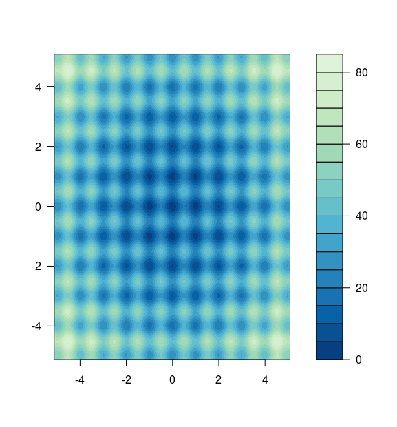

# Interactive Genetic Algorithm Example

## Overview

This is a an R Shiny application using Luca Scrucca's [GA package](https://luca-scr.github.io/GA/).

The optimisation example searches for optimum values for two dimensions
to minimise the Rastrigin function. A plot of this function is shown below:

.

Note that optimum value for both dimensions is zero, and that many local
minima are present.

Users can explore the impact of different values for:

- population size
- mutation probability
- crossover probability
- elitism
- number of generations.

## Implementation

The application makes use of the [future](https://cran.r-project.org/web/packages/future/index.html) package to allow the GA to run asynchronously, and the [ipc package](https://cran.r-project.org/web/packages/ipc/index.html) for passing messages between the GA and Shiny.

## Give it a try

This application is deployed at http://shiny-ga-demo.uksouth.azurecontainer.io:3838/ for you to try (assuming the hosting doesn't cost me too much).
